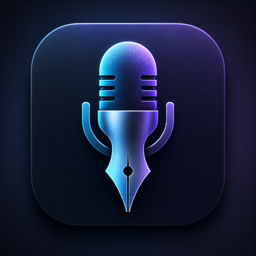

# DeskScribe

<p align="center">
  
</p>

DeskScribe is a macOS menu bar dictation app that runs local speech recognition through a native ONNX Runtime path.

## What It Does

- Runs ASR locally in the macOS app process, without a Python worker.
- Downloads versioned ONNX model packages from Hugging Face on first use.
- Starts and stops dictation with `Option+Space` by default.
- Shows live partial transcription while recording.
- Pastes the final transcript into the previously active app.
- Supports custom hotkeys, trigger mode, model selection, vocabulary replacement rules, transcript history, and launch-at-login.

## Models

DeskScribe currently supports native-compatible NeMo Conformer TDT ONNX packages:

- NVIDIA Parakeet TDT 0.6B v3 Multilingual ONNX: `geier/deskscribe-nvidia-parakeet-tdt-0.6b-v3-onnx` (default)
- DeskScribe PrimeLine ONNX: `geier/deskscribe-parakeet-primeline-onnx`
- NVIDIA Parakeet TDT 0.6B v2 English ONNX: `geier/deskscribe-nvidia-parakeet-tdt-0.6b-v2-onnx`

Models are installed under:

```text
~/Library/Application Support/DeskScribe/Models/
```

Each model package is distributed as a ZIP plus manifest and SHA256 checksum. The app verifies the archive before installing it.

## Permissions

DeskScribe needs:

- Microphone access for recording.
- Accessibility access for the global hotkey event tap and automatic paste.

## Install

Homebrew is the primary install path for users:

```bash
brew tap geier/deskscribe https://github.com/geier/deskscribe
brew install --cask deskscribe
```

After launching DeskScribe, approve Microphone and Accessibility permissions when macOS asks. The selected speech model is downloaded automatically the first time it is needed and stored locally under:

```text
~/Library/Application Support/DeskScribe/Models/
```

The cask is maintained in `homebrew/Casks/deskscribe.rb`.

## Build

Install ONNX Runtime with Homebrew:

```bash
brew install onnxruntime
```

Build the native debug app:

```bash
scripts/build_parallel_debug.sh
```

Build the release app:

```bash
scripts/build_onnx_release.sh
```

Package a Homebrew-ready release ZIP and SHA256:

```bash
VERSION=0.1.0 scripts/package_homebrew_release.sh
```

This writes `dist/DeskScribe-0.1.0-macos.zip` and `dist/DeskScribe-0.1.0-macos.zip.sha256`.

Install the release app locally:

```bash
scripts/install_release_onnx_app.sh
```

The installed app path is:

```text
/Applications/DeskScribe.app
```

Logs are written to:

```text
~/Library/Logs/DeskScribeONNX/DeskScribeONNX.log
```

## Development

The Xcode project lives at:

```bash
macos/ParakeetDictation/ParakeetDictation.xcodeproj
```

Open it with:

```bash
open macos/ParakeetDictation/ParakeetDictation.xcodeproj
```

The main development scheme is `DeskScribeONNX`.

## Model Tooling

Python is only used for development tooling: exporting NeMo checkpoints to ONNX, validating exported packages, packaging ZIP manifests, and uploading model artifacts.

```bash
/opt/homebrew/bin/python3.13 -m venv .venv
.venv/bin/python -m pip install --upgrade pip setuptools wheel
.venv/bin/python -m pip install -r requirements-onnx.txt -r requirements-hf.txt
```

Export, validate, and package a model:

```bash
.venv/bin/python scripts/export_nemo_onnx.py --output-dir models/parakeet-primeline-onnx
.venv/bin/python scripts/validate_onnx_export.py models/parakeet-primeline-onnx --fixtures docs/onnx-fixtures.example.json
.venv/bin/python scripts/package_onnx_model.py --version v1 --repo geier/deskscribe-parakeet-primeline-onnx
```

Compare native app output against `onnx-asr`:

```bash
.venv/bin/python scripts/compare_native_onnx.py \
  models/parakeet-primeline-onnx \
  --fixtures docs/onnx-fixtures.example.json \
  --native-app /path/to/DeskScribe.app \
  --repo-root /path/to/deskscribe
```

## Homebrew Cask Development

The cask template lives at:

```bash
homebrew/Casks/deskscribe.rb
```

After publishing a release, update the cask version and sha256. It downloads:

```ruby
url "https://github.com/geier/deskscribe/releases/download/v#{version}/DeskScribe-#{version}-macos.zip"
```

Install from a tap with:

```bash
brew tap <owner>/deskscribe
brew install --cask deskscribe
```
